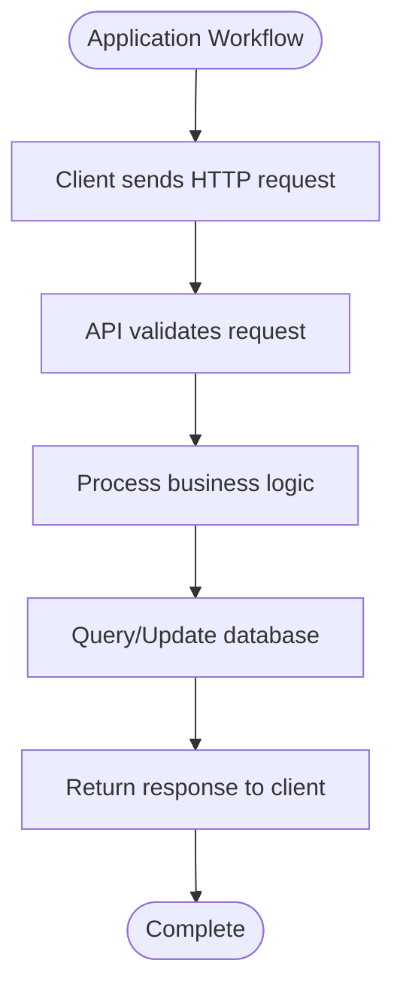
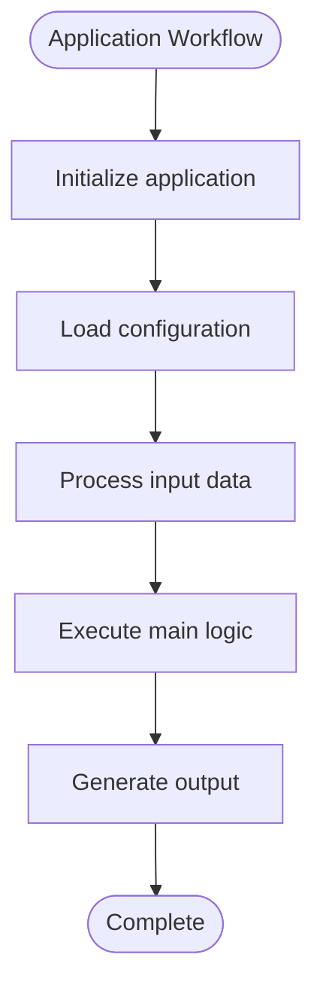
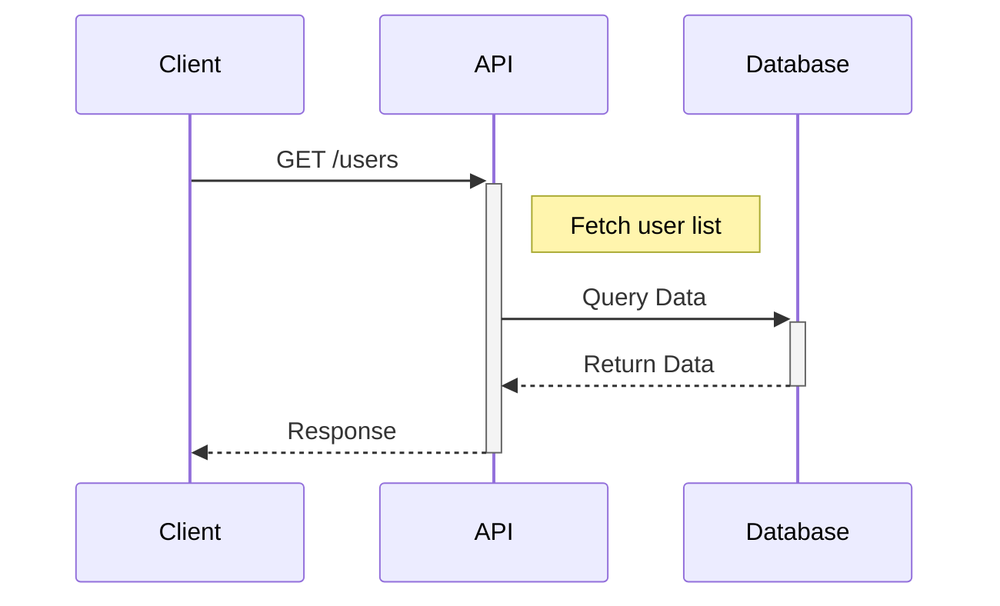
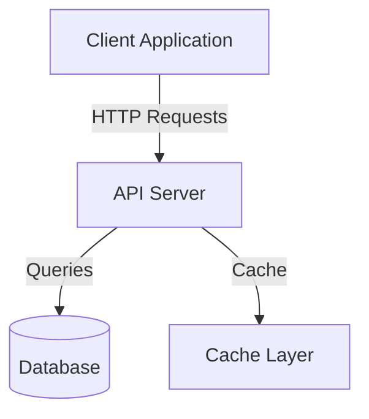
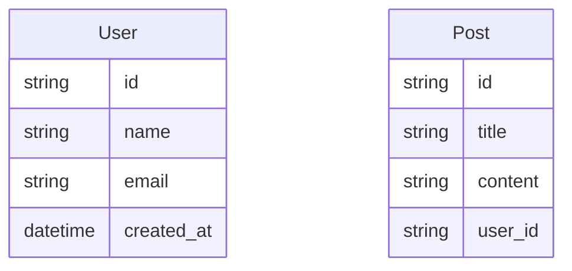
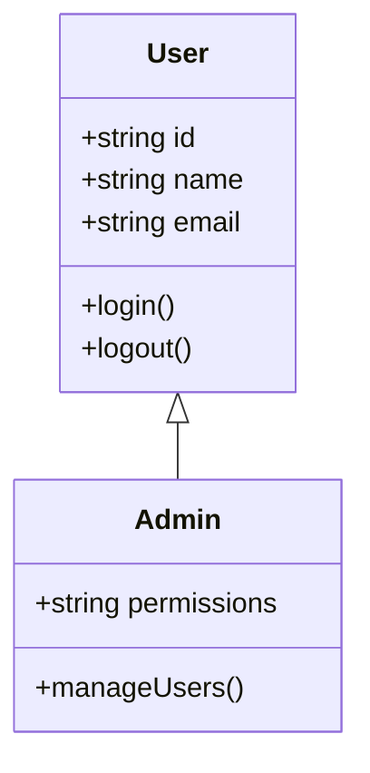

# 📊 Diagram Features - Complete Guide

## ✅ All Diagram Types Implemented!

Your README Generator now supports **5 types of Mermaid diagrams**:

### 1. 🔄 Flowcharts ✨ NEW!
**What it shows:** Application workflow and process flow

**When generated:**
- Automatically included in Usage sections
- Shows step-by-step process flow

**Example for API projects:**


**Example for general applications:**


---

### 2. 📈 Sequence Diagrams
**What it shows:** API request/response flow with timing

**When generated:**
- When API endpoints are detected
- Shows interaction between Client, API, and Database

**Example:**


---

### 3. 🏗️ Architecture Diagrams
**What it shows:** System components and their relationships

**When generated:**
- When Architecture section is requested
- Shows high-level system design

**Example:**


---

### 4. 📊 ER Diagrams (Entity-Relationship)
**What it shows:** Database models and their fields

**When generated:**
- When Pydantic models or database models are detected
- Shows data structure

**Example:**


---

### 5. 🎯 Class Diagrams ✨ NEW!
**What it shows:** Object-oriented class structure

**When generated:**
- When 2 or more classes are detected
- Shows class hierarchy, attributes, and methods

**Example:**


---

## 🎨 How to Use

### From Streamlit UI:
1. Go to sidebar → **Diagram Options**
2. Check the diagrams you want:
   - ✅ Include Flowchart (Process Flow)
   - ✅ Include Sequence Diagrams (API Flow)
   - ✅ Include Architecture Diagram
   - ✅ Include Class Diagrams
   - ✅ Include ER Diagrams (Data Models)

### From API:
```json
{
  "repo_url": "https://github.com/user/repo.git",
  "include_diagrams": true,
  "sections": [
    "usage",
    "api_docs",
    "architecture"
  ]
}
```

---

## 🔍 Diagram Placement

The generator intelligently places diagrams in appropriate sections:

| Diagram Type | Placement | Section |
|-------------|-----------|---------|
| **Flowchart** | `## Usage` | Shows how to use the application |
| **Sequence** | `## API Documentation` | Shows API request flow |
| **Architecture** | `## Architecture` | System design overview |
| **ER Diagram** | `## API Documentation` | Data model structure |
| **Class Diagram** | `## Architecture` or `## Code Structure` | OOP design |

If the specific section doesn't exist, diagrams are appended at the end.

---

## 📝 Customization

### Flowchart Customization
The flowchart automatically adapts based on project type:

**For REST APIs:**
1. Client sends HTTP request
2. API validates request
3. Process business logic
4. Query/Update database
5. Return response to client

**For Applications:**
1. Initialize application
2. Load configuration
3. Process input data
4. Execute main logic
5. Generate output

### Control Diagram Generation

**Disable specific diagrams:**
- Just don't select them in the UI
- Or omit the section from API request

**Limit diagram complexity:**
- Sequence diagrams: Limited to 10 endpoints
- ER diagrams: Limited to 5 models
- Class diagrams: Limited to 5 classes
- Flowcharts: 5 steps for clarity

---

## 🎯 Best Practices

### 1. Enable Relevant Diagrams
- **API projects**: Flowchart + Sequence + ER diagrams
- **Libraries**: Class diagrams + Architecture
- **Full-stack apps**: All diagram types

### 2. Ensure Clean Code
- Well-structured code → Better diagrams
- Clear function/class names → Readable diagrams
- Good comments → Better context

### 3. Section Selection
- Include "Usage" section → Gets flowchart
- Include "API Documentation" → Gets sequence + ER diagrams
- Include "Architecture" → Gets architecture + class diagrams

---

## 🚀 Try It Now!

### Test with Your Repository:
1. Start production server: `python run_production.py`
2. Start Streamlit UI: `streamlit run ui/streamlit_app.py`
3. Enter repository URL
4. **Enable all diagram options** in sidebar
5. Generate README
6. See all 5 diagram types! 🎉

### Example Repositories:
- **FastAPI Project**: Gets flowchart, sequence, ER, and architecture diagrams
- **Django Project**: Gets all diagram types
- **Python Library**: Gets flowchart, class, and architecture diagrams

---

## 📊 What Changed?

### Before (Had 2 diagram types):
- ✅ Sequence diagrams
- ✅ Architecture diagrams

### Now (5 diagram types):
- ✅ **Flowcharts** ← NEW!
- ✅ Sequence diagrams
- ✅ Architecture diagrams
- ✅ **ER diagrams** ← ENHANCED!
- ✅ **Class diagrams** ← NEW!

---

## 🎨 Visual Examples

Your generated READMEs will now include beautiful visual diagrams that:
- 📖 Make documentation easier to understand
- 🎯 Show system flow at a glance
- 🏗️ Explain architecture visually
- 💡 Help new developers onboard faster
- ⚡ Reduce the need for lengthy text explanations

---

**All diagram types are now active and ready to use!** 🎉

Generate a new README to see all the diagram types in action!

---

*Updated: November 7, 2025*
*Status: All Features Active ✅*
